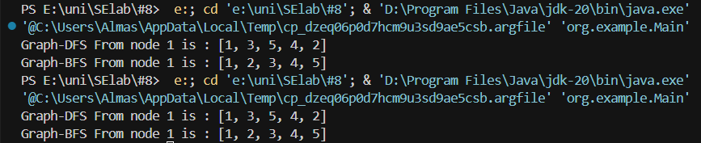

# SE_lab_s8
# Fisrst
---

## ۱. تعریف واسط (Interface) مستقل گراف

برای مستقل کردن کد از هر کتابخانه، یک واسط به نام `GraphAdapter` تعریف می‌کنیم که متدهای مورد نیاز را استانداردسازی می‌کند:

```java
public interface GraphAdapter {
    void addVertex(Integer v);
    void addEdge(String e, Integer v1, Integer v2);
    List<Integer> getNeighbors(Integer v);
}
```

---

## ۲. پیاده‌سازی Adapter برای JUNG

در این قدم، واسط را با استفاده از کلاس‌های کتابخانه JUNG پیاده‌سازی می‌کنیم:

```java
import edu.uci.ics.jung.graph.SparseMultigraph;

import java.util.ArrayList;
import java.util.List;

public class Adapter implements GraphAdapter {
        private final SparseMultigraph<Integer, String> graph = new SparseMultigraph<>();

        @Override
        public void addVertex(Integer v) {
            graph.addVertex(v);
        }

        @Override
        public void addEdge(String e, Integer v1, Integer v2) {
            graph.addEdge(e, v1, v2);
        }

        @Override
        public List<Integer> getNeighbors(Integer v) {
            return new ArrayList<>(graph.getNeighbors(v));
        }

}
```

---

## ۳. بازنویسی Traverserها (پیمایش‌گرها) برای استفاده از Adapter

کلاس‌های `DfsGraphTraverser` و `BfsGraphTraverser` بازنویسی شده‌اند تا فقط از واسط استفاده کنند و به JUNG وابسته نباشند. مثال BFS:

```java
public class BfsGraphTraverser implements Traverser {
    private final Adapter graph;

    public BfsGraphTraverser(Adapter graph) {
        this.graph = graph;
    }

    @Override
    public List<Integer> traverse(Integer startVertex) {
        List<Integer> result = new ArrayList<>();
        Set<Integer> visited = new HashSet<>();
        Queue<Integer> queue = new LinkedList<>();

        queue.add(startVertex);
        visited.add(startVertex);

        while (!queue.isEmpty()) {
            Integer vertex = queue.poll();
            result.add(vertex);

            List<Integer> neighbors = graph.getNeighbors(vertex);
            neighbors.sort(Comparator.naturalOrder());

            for (Integer neighbor : neighbors) {
                if (!visited.contains(neighbor)) {
                    visited.add(neighbor);
                    queue.add(neighbor);
                }
            }
        }
        return result;
    }
}
```

---

## ۴. استفاده در بخش Main

در کلاس `Main`، از واسط و Adapter برای ساخت گراف و پیمایش با DFS و BFS استفاده می‌شود:

```java
public class Main {
    public static void main(String[] args) {
        Adapter graph = new Adapter();
        ...
        }
    }
```

---

## ۵. مزایای این ساختار

- تمام وابستگی‌ها به یک کتابخانه فقط در یک نقطه (Adapter) جمع شده است.
- مهاجرت به هر کتابخانه‌ی گراف دیگر فقط با اضافه کردن یک Adapter جدید انجام می‌شود.
- باقی کد پروژه ثابت و مستقل از نوع پیاده‌سازی گراف می‌ماند.

---

# second
---
همانطور که گفته شده، در این بخش صرفا به تغییر فایل adapter میپردازیم و انتظار داریم که کد به درستی کار کند و خروجی مشابه بخش قبلی دهد.

---
## پیاده سازی Adapter برای JGraphT

```java
import org.jgrapht.graph.DefaultEdge;
import org.jgrapht.graph.SimpleGraph;

import java.util.ArrayList;
import java.util.List;
import java.util.Set;

public class Adapter implements GraphAdapter {
    private final SimpleGraph<Integer, DefaultEdge> graph = new SimpleGraph<>(DefaultEdge.class);

    @Override
    public void addVertex(Integer v) {
        graph.addVertex(v);
    }

    @Override
    public void addEdge(String e, Integer v1, Integer v2) {
        graph.addEdge(v1, v2);
    }

    @Override
    public List<Integer> getNeighbors(Integer v) {
        Set<DefaultEdge> edges = graph.edgesOf(v);
        List<Integer> neighbors = new ArrayList<>();
        for (DefaultEdge edge : edges) {
            Integer source = graph.getEdgeSource(edge);
            Integer target = graph.getEdgeTarget(edge);
            if (source.equals(v)) {
                neighbors.add(target);
            } else {
                neighbors.add(source);
            }
        }
        return neighbors;
    }

```

---

همانطور که در تصویر زیر مشاهده میکنید، خروجی کد main برای هر دو Adapter مشابه است:



---
